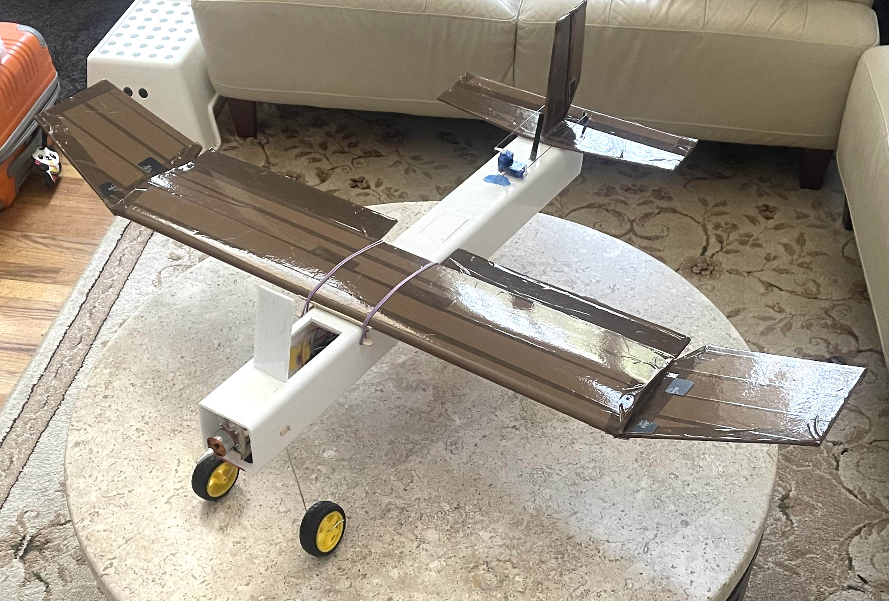
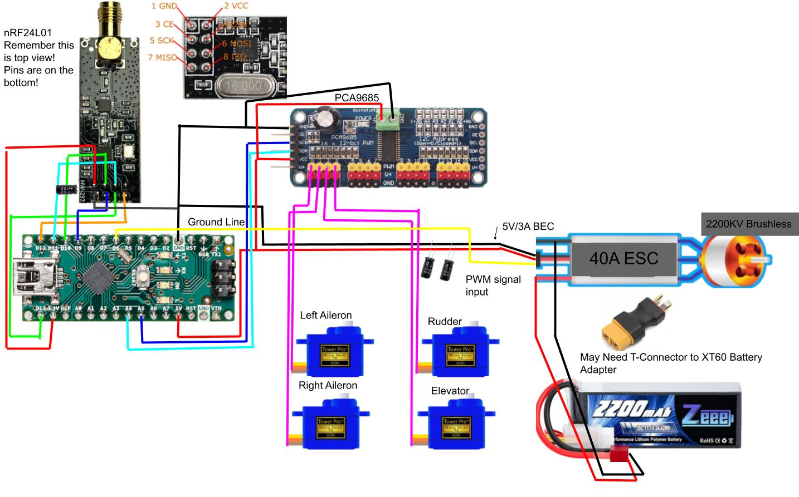
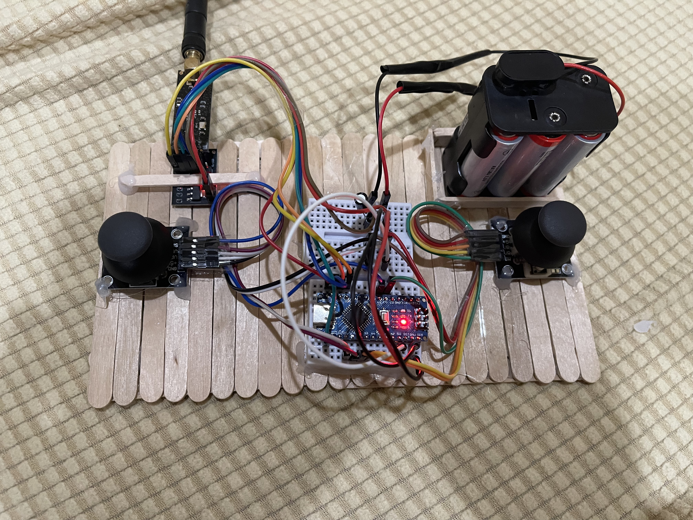
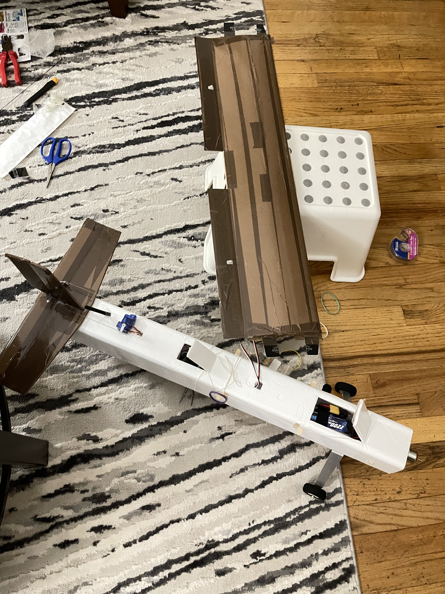

<h3 align="center">Arduino Based Plane and Controller</h3>

<!-- <div align="center">

[](http://hackathon.url.com)
[]()
[](https://github.com/kylelobo/The-Documentation-Compendium/issues)
[](https://github.com/kylelobo/The-Documentation-Compendium/pulls)
[](LICENSE.md)

</div> -->

---

<p align="center"> A concept build to create an full-sized, arduino-based plane and transmitter than in theory is the cheapest method, yet is a great learning project.
    <br> 
</p>

## 📝 Table of Contents

- [Goal](#goal)
- [Dependencies / Limitations](#limitations)
- [Design](#design)
- [Materials/Supplies](#Materials/Supplies)
- [Build](#Build)
- [Usage](#usage)
- [Contributing](../CONTRIBUTING.md)
- [Authors](#authors)
- [Acknowledgments](#acknowledgments)
- [Debugging](#Debugging)

## 🧐 Problem Statement <a name = "goal"></a>

Create a simple plane with a front motor with ailerons, elevator, rudder, and landing gear. 

## ⛓️ Dependencies / Limitations <a name = "limitations"></a>

- Arduinos typically do not have sufficent PWM pins, hence a pca9685 must be used
- Reciever in the airplane must have soldered parts, to maintain stability
- Electrical interference: apparently the BEC in my 40A ESC could not handle the load spikes of with the servos, even if I used the NRF24l01 breakout board adapter which has a AMS1117-3.3.
- - Thus I opted to use the 3.3v line directly off the arduino with an additional 22uF electrolytic capacitor directly soldered onto the NRF24l01 3.3v and GND lines.

## 💡 Design <a name = "design"></a>
Reciever



Controller


Data structure:
```
struct Data_Pack {
  byte leftx;
  byte lefty;
  bool leftb;
  byte rightx;
  byte righty;
  bool rightb;
}
```

## 🏁 Materials/Supplies <a name = "Materials/Supplies"></a>

Physical: 
- Minimum 6 Dollar Tree foam boards
- Control rods and horns (do NOT cheap out)
- Hot Glue
- Packing Tape
- Mounting Tape
- Rubber Bands
- Popsicle Sticks
- PVC cards or other sturdy flat materials
- Landing gear (DO NOT CHEAP OUT, I REPEAT, DO NOT CHEAP OUT)
- tools, etc.

Electrical:
- 2x Arduino Nano
- Various wires and PWM 3-pin wires
- Wire Stripper
- 5x 22uF electroyltic capacitor (ceramic also works)

Transmitter:
- 9x AA battery holder
- 2x joystick
- NRF24l01+PA+LNA + breakout board adapter
- Breadboard

Reciever: 
- Soldering Iron and stand
- Perf boards
- NRF24l01+PA+LNA
- PCA9685
- 40A ESC and 2200KV Brushless motor
- 4x 9g servo
- 3s Lipo battery (and charger)

### Prerequisites

- Arduino Programming
- Electronics knowledge up to knowing how to use bypass/decoupling capacitors
- Having fun

## ⛏️ Built <a name = "Build"></a>

Transmitter:
Build any way you like, just feed the battery power directly into the NRF24l01+ adapter and get it to send out the data struct.

Plane:
Huge Credits to: Experimental Airlines
- [Wings](https://www.youtube.com/watch?v=karr67ZYho4): https://www.youtube.com/watch?v=karr67ZYho4 check out his other videos for further details
- [Fuselage](https://www.youtube.com/watch?v=Xafg-o83L94): https://www.youtube.com/watch?v=Xafg-o83L94
- [Control Surfaces](https://www.youtube.com/watch?v=e1_pjhQWj98): https://www.youtube.com/watch?v=e1_pjhQWj98
- [Stabilizers](https://www.youtube.com/watch?v=YYhMjc6tNQ4): https://www.youtube.com/watch?v=YYhMjc6tNQ4
- [Control Horns](https://www.youtube.com/watch?v=RpIdJX5Jagw): https://www.youtube.com/watch?v=RpIdJX5Jagw
- [Hatches](https://www.youtube.com/watch?v=4zaX5wLmI2U): https://www.youtube.com/watch?v=4zaX5wLmI2U
- Wing Alignment tuning:
Line 93


Reciever:
Solder together and secure with rope or velcro.


## 🎈 Usage <a name="usage"></a>

Left joystick y-axis is throttle
Left joystick x-axis is rudder (disabled for now)
Right joystick x-axis is aileron control
Right joystick y-axis is elevator control

LEARN HOW TO FLY A PLANE, THERE IS NO FLIGHT CONTROL SOFTWARE NOR GYROSCOPE/ACCELEROMETER
- [Flight Game](https://www.geo-fs.com/): https://www.geo-fs.com/

## ✍️ Authors <a name = "authors"></a>

- [@BryanNoBryan](https://github.com/BryanNoBryan) - Idea & Work

## 🎉 Acknowledgments <a name = "acknowledgments"></a>

Huge Credits to: Experimental Airlines

## 🚀 Debugging <a name = "Debugging"></a>

- If you have an "off-brand" arduino, you may need to select "old bootloader" in Arduino IDE
- For any reason, if you cannot upload code, open the serial monitor to 1200 baud (trust me, it helps)
